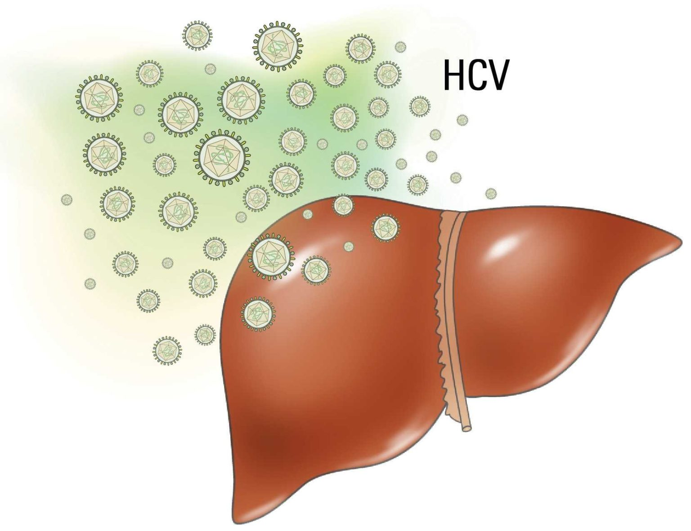

```{r setup, include=FALSE}
knitr::opts_chunk$set(echo = TRUE, warning = FALSE, message = FALSE)
library(tidyverse)
```

---
# Warm-up: The Data

## 1.1 What are we working with?

This session uses **simulated data based on a subset of variables from the
[STOP-HCV consortium](https://www.expmedndm.ox.ac.uk/research/stop-hcv)**,
a UK-based study of Hepatitis C virus (HCV) infection. The data have been simulated for teaching purposes and do not represent
actual study participants.

HCV (Hepatitis C Virus) is a leading cause of chronic liver disease worldwide.

{width=400px}

```{r load-data}
hcv_dataset <- readRDS("hcv_dataset.rds")
```

The dataset is a list with three parts: `phenotype` (the outcomes), `HLA` (the genotypes) and `covariate` (patient characteristics).

```{r}
names(hcv_dataset)[1:3]
```

### Phenotypes

- **Viral load** is measured on a continuous scale (log10 IU/mL).
- **Cirrhosis** is binary (yes/no).
- **Fibrosis** is a continuous liver fibrosis score (simulated, arbitrary units). We will use it in the causal thinking session.

```{r}
pheno <- hcv_dataset$phenotype
head(pheno)
```

```{r outcomes, echo=FALSE, fig.width=12, fig.height=4}
par(mfrow = c(1, 3))

hist(pheno$viral_load,
     main = "HCV viral load",
     xlab = "log10(viral load, IU/mL)",
     col = "#6baed6", border = "white", breaks = 50,
     freq = FALSE)
curve(dnorm(x, mean = mean(pheno$viral_load), sd = sd(pheno$viral_load)),
      col = "#de2d26", lwd = 2, add = TRUE)

cirr_n <- table(factor(pheno$cirrhosis, levels = c("No", "Yes")))
barplot(prop.table(cirr_n) * 100,
        main = "Cirrhosis",
        names.arg = paste0(names(cirr_n), " (N = ", cirr_n, ")"),
        col = c("#74c476", "#fd8d3c"),
        border = "white",
        ylab = "Percentage (%)")

hist(pheno$fibrosis,
     main = "Fibrosis",
     xlab = "Fibrosis score (simulated, arbitrary units)",
     col = "#6baed6", border = "white", breaks = 50,
     freq = FALSE)
curve(dnorm(x, mean = mean(pheno$fibrosis), sd = sd(pheno$fibrosis)),
      col = "#de2d26", lwd = 2, add = TRUE)
```

<div style="border-left: 4px solid #428bca; padding: 10px 15px; background-color: #f5f5f5;">
**Note:** Because the raw viral load values span several orders of magnitude, we work with `log10(viral load)` throughout, which brings the distribution close to normal (red curve) and makes regression coefficients interpretable.
</div>

### Genetics

HLA (Human Leukocyte Antigen) is a highly polymorphic gene complex on chromosome 6 that plays a central role in immune recognition. Two properties of HLA are particularly important for this session:

- **High polymorphism** — there are hundreds of alleles at each locus, meaning individuals differ substantially in their HLA genotype.
- **Linkage disequilibrium (LD)** — alleles at different HLA loci tend to co-occur more often than expected by chance.

*(You can read [Shiina et al. (2009)](https://www.nature.com/articles/jhg20085) for a more detailed overview of HLA genetics if you are interested.)*

Each allele is coded as the number of copies a patient carries (0, 1 or 2). The first column is the sample ID.

```{r}
hla <- hcv_dataset$HLA
hla[1:5, 1:6]
```

```{r fig.width=9, echo = FALSE, fig.height=4}
par(mar = c(10, 4, 2, 3))
allele_freq <- colSums(hla[, -1]) / (2 * nrow(hla))
names(allele_freq) <- sub("^HLA_([A-Z0-9]+)\\.(\\d+)\\.(\\d+)$", "\\1*\\2:\\3", names(allele_freq))

barplot(allele_freq,
        las = 2, ylim = c(0, 1),
        col = "#6baed6", border = "white",
        main = "HLA allele frequencies",
        ylab = "Allele frequency")
abline(h = 0.05, lty = 2, col = "grey40")
```

This dataset includes `r ncol(hla) - 1` common HLA alleles, each with a frequency greater than 5% (dashed line) in the study population.

### Cohort characteristics

In addition to HLA genotypes, we have five patient characteristics: age, sex, BMI, genetic ancestry (two populations, coded 0/1) and ALT (alanine aminotransferase, a blood marker of liver inflammation, IU/L).

```{r}
covar <- hcv_dataset$covariate
head(covar)
```

```{r fig.width=12, echo = FALSE, fig.height=6}
par(mfrow = c(2, 3))

hist(covar$AGE,
     main = "Age", xlab = "Age (years)",
     col = "#6baed6", border = "white", breaks = 20)

barplot(table(covar$SEX),
        main = "Sex",
        col = c("#fc8d59", "#91bfdb"),
        border = "white",
        ylab = "Count")

hist(covar$BMI,
     main = "BMI", xlab = expression("BMI (kg/m"^2*")"),
     col = "#74c476", border = "white", breaks = 20)

barplot(table(covar$ANCESTRY),
        main = "Genetic ancestry",
        names.arg = c("Ancestry group 1", "Ancestry group 2"),
        col = c("#bcbddc", "#756bb1"),
        border = "white",
        ylab = "Count")

hist(covar$ALT,
     main = "ALT", xlab = "ALT (IU/L)",
     col = "#fd8d3c", border = "white", breaks = 30)
```

Given prior epidemiological evidence that age, sex, and BMI are associated with HCV outcomes, we will treat these as covariates throughout our analyses. Ancestry and ALT play a special role, which we will come back to in the causal thinking session: adding a variable to a model is not always harmless.

Note that a few patients have missing age or BMI:

```{r}
colSums(is.na(covar))
```

# 1.2 Checklist: what we will learn
 
In this course we will learn how to analyse data like these with regression:
 
1. **Linear regression**: model a *continuous* outcome such as viral load, and interpret the effect of each HLA allele copy.
2. **Logistic regression**: model a *binary* outcome such as cirrhosis (yes/no), and interpret effects as odds ratios.
3. **Regularised regression**: fit many correlated HLA alleles *jointly*, using a penalty to tell which allele is really driving a signal.
4. **Causal thinking**: use directed acyclic graphs (DAGs) to decide *which variables to adjust for*, and which ones to leave out (confounders, mediators and colliders).
 