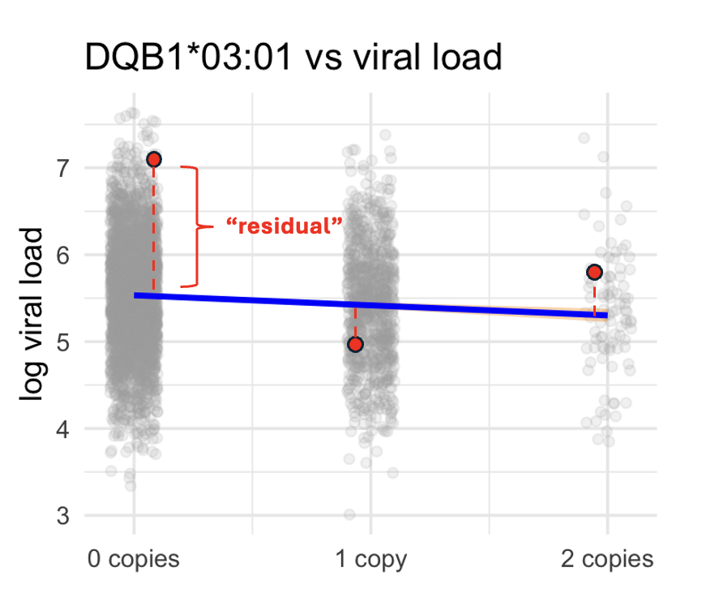

```{css, echo=FALSE}
.highbox {
  color: #023103;
  background-color: #E6F6E6;
  border: 1px solid #E6F6E6;
  padding: 12px 15px;
  border-radius: 4px;
  text-align: left;
  margin: 20px 0;
}
```

```{r klippy, echo=FALSE, include=TRUE}
klippy::klippy(position = c('top', 'right'))
```

```{r echo=FALSE, warning=FALSE}
library(knitr)
library(DT)
```

In this tutorial, we will learn how to perform linear regression, centred around the following research question:

<div class="highbox">
<strong>Question:</strong> Is HCV viral load associated with HLA alleles? We will start with one allele, <strong>HLA-DQB1*03:01</strong>.
</div>

## Prerequisites

Before we start, please make sure that you have **RStudio** installed on your laptop (Jupyter also works, as long as it has an R kernel, e.g. [IRkernel](https://irkernel.github.io/)), and that the required R packages are installed. If any are missing, you can install them with `install.packages()`:

```{r install, eval=FALSE}
install.packages(c("ggplot2", "dplyr"))
```

Then load the packages we will use in this tutorial:

```{r libraries, message=FALSE, warning=FALSE}
library(ggplot2)   # plots
library(dplyr)     # data manipulation, e.g. group_by() and summarise()
```

## Load the data

The dataset for this tutorial, `hcv_dataset.rds`, can be downloaded from [this GitHub repository](https://github.com/QiJingS). Save it in the same folder as this R Markdown file (or set your working directory to that folder with `setwd()`), so that R can find it.

<div class="highbox">
<strong>What is an <code>.rds</code> file?</strong>
An <code>.rds</code> file stores a single R object in a compressed binary format. You can save any object to it with <code>saveRDS()</code> and read it back with <code>readRDS()</code>, which keeps the object's exact structure (data types, factor levels, etc.) intact.
</div>

Once you've downloaded the file, load it. The object is a **list**, so we first check what it contains:

```{r load-data}
hcv_dataset <- readRDS("hcv_dataset.rds")
names(hcv_dataset)[1:3]
```

We will use three parts of it, and give each a short name:

```{r split-data}
HLA_alleles <- hcv_dataset$HLA        # HLA genotypes: copies (0/1/2) of each allele
pheno       <- hcv_dataset$phenotype  # outcomes: viral load, cirrhosis, fibrosis
covar       <- hcv_dataset$covariate  # patient characteristics: age, sex, BMI, ...

c(HLA = nrow(HLA_alleles), phenotype = nrow(pheno), covariate = nrow(covar))
```

All three tables have one row per patient, **in the same order**: row 1 of `pheno` is the same patient as row 1 of `HLA_alleles` and row 1 of `covar`. This is what lets us combine them later.

### Quick look {.tabset}

Before diving in, let's take a quick look at each of the three objects.

#### HLA alleles

The first column is the sample `ID`. Every other column is one HLA allele, coded as the **number of copies** the patient carries: 0, 1 or 2 (we inherit one copy of chromosome 6 from each parent). For example, `HLA_DQB1.03.01` is the allele HLA-DQB1\*03:01.

```{r echo=FALSE}
datatable(head(HLA_alleles, 5), options = list(scrollX = TRUE))
```

#### Phenotype

`viral_load` is the HCV viral load on the log10 scale (log10 IU/mL), so a difference of 1 means a 10-fold difference in the amount of virus. `cirrhosis` is Yes/No, and `fibrosis` is a liver fibrosis score that we will use in a later session.

```{r echo=FALSE}
datatable(head(pheno, 5), options = list(scrollX = TRUE))
```

#### Covariates

Age (years), sex, BMI (kg/m²), genetic ancestry and ALT (a blood marker of liver inflammation, IU/L). A few patients have missing age or BMI (`NA`).

```{r echo=FALSE}
datatable(head(covar, 5), options = list(scrollX = TRUE))
```

## {.unlisted .unnumbered}

## Is HLA-DQB1\*03:01 related to HCV viral load?

To get a first impression, we can visualise how HCV viral load is distributed across the three DQB1\*03:01 groups (0, 1 or 2 copies).

```{r relationship, echo=FALSE, fig.width=6, fig.height=4, warning=FALSE}
library(ggdist)

plot_df <- data.frame(
  vl = pheno$viral_load,
  g  = factor(HLA_alleles$HLA_DQB1.03.01,
              levels = c(0, 1, 2),
              labels = c("0 copies", "1 copy", "2 copies"))
)
means <- plot_df %>% group_by(g) %>% summarise(m = mean(vl), .groups = "drop")

set.seed(1)
ggplot(plot_df, aes(g, vl)) +
  ggdist::stat_slab(fill = "#4C78A8", alpha = 0.25,
                    width = 0.5, justification = -0.02) +
  geom_point(aes(x = as.integer(g) - 0.2 + runif(nrow(plot_df), -0.1, 0.1)),
             size = 1.5, alpha = 0.15, colour = "darkgrey") +
  geom_boxplot(width = 0.10, outlier.shape = NA) +
  geom_point(data = means, aes(y = m), colour = "#E45756", shape = 18, size = 2.4) +
  geom_text(data = means, aes(y = m, label = sprintf("%.2f", m)),
            colour = "#E45756", hjust = 1, nudge_x = -0.08, size = 3.5, fontface = "bold") +
  labs(x = "Copies of DQB1*03:01", y = "log10 viral load (IU/mL)",
       title = "DQB1*03:01 vs viral load") +
  theme_minimal(base_size = 12)
```

The plot shows every patient (grey dots), the shape of the distribution in each group (blue), and the group mean (red). Let's compute the number of patients and the mean viral load in each group:

```{r group-means}
df1 <- data.frame(
  vl       = pheno$viral_load,
  hla_dqb1 = factor(HLA_alleles$HLA_DQB1.03.01,
                    levels = c(0, 1, 2),
                    labels = c("0 copies", "1 copy", "2 copies"))
)

group_means <- df1 %>%
  group_by(hla_dqb1) %>%
  summarise(n = n(), mean_vl = mean(vl), .groups = "drop")
group_means
```

Comparing the group means, viral load **decreases** with the number of DQB1\*03:01 copies a patient carries (0 copies > 1 copy > 2 copies). But the difference is **small** compared with how much patients vary within each group: the three distributions overlap almost completely. Note also that only `r group_means$n[3]` patients carry two copies, so the mean of that group is much less precise than the others.

So, is there a way to quantify this relationship more precisely, with a single number, and to say how sure we are about it?

### Linear model {.tabset}

Fitting a straight line through the data lets us capture the association between **DQB1\*03:01** and **viral load** in a single number: the slope of the line. To do this, we treat the number of copies as a number (0, 1, 2) on the x-axis.

#### Plot

```{r plot-out, echo=FALSE, fig.width=5, fig.height=4, out.width='70%'}
ggplot(df1, aes(as.integer(hla_dqb1) - 1, vl)) +
  geom_point(position = position_jitter(width = 0.1, seed = 1),
             size = 1.5, alpha = 0.15, colour = "darkgrey") +
  geom_smooth(method = "lm", formula = y ~ x,
              fill = "#F4A340", colour = "blue") +
  stat_summary(fun = mean, geom = "point",
               shape = 18, size = 3, colour = "#E45756") +
  scale_x_continuous(breaks = 0:2,
                     labels = c("0 copies", "1 copy", "2 copies")) +
  labs(x = "Copies of DQB1*03:01", y = "log10 viral load (IU/mL)",
       title = "DQB1*03:01 vs viral load",
       subtitle = "Blue: fitted line; red diamond: group mean") +
  theme_minimal(base_size = 12)
```

#### Code

```{r plot-code, ref.label='plot-out', eval=FALSE}
```

### {.unlisted .unnumbered}

The blue line slopes gently downwards and passes close to the three group means (red). There is also an orange band around the line (its 95% confidence interval). It is barely visible because the line is estimated precisely, and is only slightly wider at 2 copies, where there are few patients. We will come back to what this means later.

Mathematically, we fit a **simple linear regression** with the allele **dosage** (number of copies) as the predictor. For patient $i$:

$$
\boxed{y_i = \beta_0 + \beta_1 x_i + \varepsilon_i}
$$

- $y_i$ is the log10 HCV viral load of patient $i$.
- $x_i$ is the number of DQB1\*03:01 copies that patient $i$ carries: 0, 1 or 2.
- $\beta_0$, the **intercept**, is the expected viral load of a patient with 0 copies.
- $\beta_1$, the **slope**, is the change in expected viral load for each additional copy.
- $\varepsilon_i$, the **residual error**, is the difference between patient $i$'s actual viral load and the line. It captures everything the model does not account for, such as age, sex, other genes, and plain measurement noise.

$\beta_1$ is the number we care about. If $\beta_1 = 0$, the line is flat and viral load does not change with dosage; if $\beta_1 \neq 0$, viral load is associated with DQB1\*03:01. From the plot, we expect $\beta_1$ to be **negative** but small: each extra copy lowers the viral load a little.

<div class="highbox">
<strong>Note: the additive model.</strong> Because $x$ enters the model as a number, the model assumes that every extra copy has the <em>same</em> effect: going from 1 to 2 copies changes viral load by $\beta_1$, just like going from 0 to 1. This is called an <strong>additive</strong> (or dosage) model, and it is the standard choice in genetic association studies. In our data, the drop from 1 to 2 copies looks a bit larger than from 0 to 1, but the 2-copy group is small, so this difference is well within what we would expect by chance.
</div>

### Finding the "best" line: ordinary least squares

So how do we find the "best" line? The most common approach is **ordinary least squares (OLS)**. The idea is: choose the line that sits as close to the data points as possible. To measure "close", we look at each point's **residual**: the vertical gap between what we actually observed and what the line predicts.

{width=400px}

For patient $i$, the residual is

$$
e_i = \underbrace{y_i}_{\text{observed}} - \underbrace{(\beta_0 + \beta_1 x_i)}_{\text{predicted}}
$$

Points above the line have positive residuals, and points below it have negative ones. If we just added them up, they would cancel out. So we **square** each residual first (this makes them all positive), then add them up. This total is called the **sum of squared errors (SSE)**:

$$
\text{SSE} = e_1^2 + e_2^2 + \cdots + e_n^2 = \sum_{i=1}^{n} e_i^2
$$

where $n$ is the number of patients (here `r nrow(pheno)`).

Let's write a small function that calculates the SSE for a given slope $\beta_1$. To keep things simple, we only try different slopes and let the intercept follow from the slope: as we will see below, the best line always passes through the centre of the data, so $\beta_0 = \bar{y} - \beta_1 \bar{x}$.

```{r sse-function}
SSE <- function(beta_1, y = pheno$viral_load, x = HLA_alleles$HLA_DQB1.03.01) {
  beta_0    <- mean(y) - beta_1 * mean(x)  # line through the centre of the data
  predicted <- beta_0 + beta_1 * x         # what the line predicts
  residual  <- y - predicted               # observed - predicted
  sum(residual^2, na.rm = TRUE)            # add up the squared residuals
}

# Compare a flat line (slope 0) with a line that slopes gently downwards:
SSE(beta_1 = 0)
SSE(beta_1 = -0.1)
```

The sloping line has a smaller SSE, so it fits the data better than the flat line. Every possible line has its own SSE. If we tilt the line a little, some points get closer and others get further away, so the SSE changes. **Ordinary least squares simply picks the line with the smallest SSE.**

Let's try a range of slopes and calculate the SSE for each:

```{r sse-grid}
beta1_grid <- seq(-0.3, 0.05, by = 0.025)
sse_values <- sapply(beta1_grid, SSE)
data.frame(beta_1 = round(beta1_grid, 3), SSE = round(sse_values, 1))
```

```{r sse-plot, fig.width=5, fig.height=4}
best <- beta1_grid[which.min(sse_values)]

plot(beta1_grid, sse_values, type = "b",
     xlab = "beta_1 (slope)", ylab = "SSE", las = 1,
     main = "Least squares fit")
grid()
abline(v = best, col = "red", lty = 2)
text(x = best, y = max(sse_values) * 0.999,
     labels = bquote(hat(beta)[1] == .(best)),
     pos = 4, col = "red")
```

The curve has one lowest point, and the slope there is our best estimate: $\hat{\beta}_1 \approx$ `r best`.

Our grid only tried slopes in steps of 0.025, so `r best` is only an approximation. For simple linear regression, the exact minimum can be found with a formula (if you are interested in how it is derived, see the *Statistical checklist*):

$$
\hat{\beta}_1 = \frac{\text{Cov}(x, y)}{\text{Var}(x)}
$$

```{r beta1-exact}
x <- HLA_alleles$HLA_DQB1.03.01
y <- pheno$viral_load
beta1_hat <- cov(x, y) / var(x)
beta1_hat
```

So each extra copy of DQB1\*03:01 goes with a `r sprintf('%.2f', abs(beta1_hat))` lower log10 viral load on average. Because viral load is on the log10 scale, this means about $10^{`r sprintf('%.2f', abs(beta1_hat))`} \approx `r sprintf('%.2f', 10^abs(beta1_hat))`$, i.e. roughly `r round(100 * (1 - 10^beta1_hat))`% less virus per copy.

Once we have the slope, the intercept follows easily. The least-squares line always passes through the "centre" of the data, the point $(\bar{x}, \bar{y})$ (average number of copies, average log10 viral load). So:

```{r beta0}
beta0_hat <- mean(y) - beta1_hat * mean(x)
beta0_hat
```

$$
\begin{aligned}
\hat{\beta}_0 &= \bar{y} - \hat{\beta}_1 \bar{x} \\[4pt]
&= \text{mean(log10 viral load)} - \hat{\beta}_1 \times \text{mean(number of DQB1*03:01 copies)} \\[4pt]
&= `r sprintf('%.2f', mean(y))` - (`r sprintf('%.3f', beta1_hat)`) \times `r sprintf('%.3f', mean(x))` = `r sprintf('%.2f', beta0_hat)`
\end{aligned}
$$

We now have our fitted linear model describing how log10 viral load changes with the number of DQB1\*03:01 copies:

$$
\widehat{\text{log10 viral load}} = `r sprintf('%.2f', beta0_hat)` - `r sprintf('%.2f', abs(beta1_hat))` \times \text{(number of DQB1*03:01 copies)}
$$

So a patient with 0 copies has a predicted log10 viral load of about `r sprintf('%.2f', beta0_hat)`, one copy about `r sprintf('%.2f', beta0_hat + beta1_hat)`, and two copies about `r sprintf('%.2f', beta0_hat + 2 * beta1_hat)`. These are close to the group means we calculated at the start (`r paste(sprintf('%.2f', group_means$mean_vl), collapse = ", ")`). But this is just our **best guess** from one sample of patients.

<div class="highbox">
<strong>Question:</strong> How good is that guess? If we had recruited a different set of patients, how different would $\hat{\beta}_1$ be?
</div>

## How good is that guess?

### How sure are we about the slope? — Standard error

If we recruited a new group of patients and fitted the line again, would we still get exactly `r sprintf('%.3f', beta1_hat)`? Almost certainly not: a different group of patients would give a slightly different slope. So **how much could it change?**

The ideal way to find out would be to **repeat the study many times**. We can't actually recruit new patients, but we can **simulate** it with a method called the **bootstrap**:

1. Draw a new "sample" of `r nrow(pheno)` patients from our own data, picked at random **with replacement** (so some patients appear more than once and others not at all).
2. Fit the line to this new sample and record its slope.
3. Repeat 1,000 times.

<div class="highbox">
<strong>Code tip:</strong> to fit the line, we use `optimize()`. It searches an interval (here −1 to 1) for the value of $\beta_1$ that makes our `SSE()` function as small as possible, i.e. the bottom of the U-shaped SSE curve.
</div>

```{r bootstrap}
set.seed(1)   # so that everyone gets the same random samples
dat <- data.frame(viral_load = pheno$viral_load,
                  dq         = HLA_alleles$HLA_DQB1.03.01)

boot_slopes <- replicate(1000, {
  idx   <- sample(nrow(dat), replace = TRUE)   # step 1: resample patients
  y_new <- dat$viral_load[idx]
  x_new <- dat$dq[idx]
  optimize(function(b) SSE(b, y = y_new, x = x_new),   # step 2: best slope
           interval = c(-1, 1))$minimum
})

hist(boot_slopes, breaks = 40, col = "grey80", border = "white",
     main = "Slopes from 1,000 simulated studies",
     xlab = "Slope from each simulated study")
abline(v = beta1_hat, col = "blue", lwd = 2)
```

Every value in the histogram is a slope we *could* have got if we had studied a different group of patients. The slopes are not all the same: they wobble around our estimate of `r sprintf('%.3f', beta1_hat)` (blue line).

The **standard error (SE)** measures how big this wobble is. It is simply the **standard deviation of the bootstrap slopes**:

```{r se}
se_boot <- sd(boot_slopes)
se_boot
```

**In words:** if we repeated this study many times, our estimated slope would typically be about `r sprintf('%.3f', se_boot)` away from the true value. The more patients we have, the smaller the SE.

::: {.highbox}
**Note: SD vs SE, don't mix them up**

- **SD** (standard deviation) describes how much **patients** differ from each other, e.g. the spread of viral loads (here `r sprintf('%.2f', sd(pheno$viral_load))`).
- **SE** (standard error) describes how much an **estimate**, like our slope, would change from study to study (here `r sprintf('%.3f', se_boot)`).

Adding more patients does not change the SD much, because people are still different. But it makes the SE smaller, because our estimate gets more precise.
:::

### Confidence interval

The SE tells us how much the slope wobbles. We can turn it into a **range** of plausible values for the true slope, called the **95% confidence interval (CI)**.

The bootstrap gives us a direct way to do this: take the histogram and cut off the most extreme 2.5% of slopes on each side. The middle 95% that remains is the 95% CI:

```{r ci}
ci <- quantile(boot_slopes, c(0.025, 0.975))
ci

hist(boot_slopes, breaks = 40, col = "grey80", border = "white",
     main = "Middle 95% of bootstrap slopes", xlab = "Slope")
abline(v = ci, col = "red", lty = 2, lwd = 2)
```

Because the histogram is bell-shaped (close to a normal distribution), there is also a shortcut that only needs the estimate and its SE:

$$
\text{95\% CI} \approx \text{estimate} \pm 1.96 \times \text{SE}
$$

```{r ci-formula}
beta1_hat + c(-1.96, 1.96) * se_boot
```

Both methods give almost the same interval. R's `lm()` uses this shortcut too, except that it calculates the SE with a formula instead of the bootstrap (we will see this at the end of the tutorial).

So each extra copy of DQB1\*03:01 is associated with a change in log10 viral load of `r sprintf('%.2f', beta1_hat)`, and the data are consistent with a true effect anywhere between `r sprintf('%.2f', ci[1])` and `r sprintf('%.2f', ci[2])`.

When you read a CI, ask two questions:

1. **Does it include 0?** A slope of 0 means **no effect**: viral load stays the same no matter how many copies of the allele a patient carries. If the CI does not include 0, the data suggest a real association. Here the whole interval is below 0, so the allele goes with *lower* viral load.
2. **How wide is it?** A narrow interval means a precise estimate; a wide one means we are still quite unsure about the size of the effect. Here the upper end is about half the lower end, so we are confident the effect is negative, but its exact size is still uncertain: anything from a small to a moderate reduction fits the data.

### Could the true slope be zero? — p-value

The CI told us that 0 ("no effect") is not among the plausible values. The p-value asks the same question from a different angle:

::: {.highbox}
**Question:** If the allele truly had no effect, how surprising would our result be?
:::

Imagine a world where the allele has **no effect at all**: the true slope is 0. If we ran our study many times in that world, each study would still give a slightly different slope, just by chance. How often would one of them be **at least as extreme as** the slope we actually estimated (`r sprintf('%.3f', beta1_hat)`)?

The slopes we would get in this "no effect" world form the **null distribution**. It has three features:

- It is **centred on 0**, because we are assuming no effect.
- Its spread is **one SE**, because the SE tells us how much an estimate naturally wobbles from study to study. We already estimated it with the bootstrap: `r sprintf('%.3f', se_boot)`.
- It is **approximately normal**, thanks to the **Central Limit Theorem**.

So we can judge how surprising our slope is by measuring how far it is from 0 **in units of SE**. This is the **test statistic**:

$$
t_{\text{obs}} = \frac{\hat\beta_1}{\text{SE}} = \frac{\text{how far our estimate is from 0}}{\text{how much it wobbles by chance}}
$$

A slope close to 0, say within about 2 SEs ($|t_{\text{obs}}| < 1.96$), is easily explained by chance. The further $t_{\text{obs}}$ lies beyond that, the harder it is to explain without a real effect. The **p-value** turns $t_{\text{obs}}$ into a probability: it is the area under the null curve that is at least as extreme as $t_{\text{obs}}$, counting both tails.

```{r p-value}
t_obs   <- beta1_hat / se_boot
df      <- nrow(dat) - 2                     # degrees of freedom: n minus 2 estimated parameters
p_value <- 2 * pt(-abs(t_obs), df = df)      # area in both tails
c(t_obs = t_obs, p_value = p_value)
```

Our slope is `r sprintf('%.1f', abs(t_obs))` SEs away from 0, far beyond the 1.96 SEs that chance alone would usually produce. This gives a p-value of about $`r sub("e-0?", "\\\\times 10^{-", sprintf("%.1e", p_value))`}$: if the allele truly had no effect, a result this extreme would happen only about once in `r format(signif(1 / p_value, 1), big.mark = ",", scientific = FALSE)` studies.

### Hypothesis testing

The p-value is part of a formal **hypothesis test**. We set up two competing statements about the true slope $\beta_1$:

- **Null hypothesis** $H_0: \beta_1 = 0$. There is **no association** between DQB1\*03:01 and viral load: viral load stays the same no matter how many copies of the allele a patient carries.
- **Alternative hypothesis** $H_1: \beta_1 \neq 0$. There **is an association** between DQB1\*03:01 and viral load.

We use $\neq$ rather than $<$ or $>$ because, before seeing the data, we did not know whether the allele would be **protective** ($\beta_1 < 0$, lower viral load) or **harmful** ($\beta_1 > 0$, higher viral load). This is a **two-sided test**, which is why the p-value counts both tails.

We start by assuming $H_0$ is true, and reject it only if the data would be very surprising under $H_0$, i.e. if $p < \alpha$. The **significance level** $\alpha$ is chosen by us before looking at the data: usually $\alpha = 0.05$, but much smaller in genome-wide association studies (GWAS), where $\alpha = 5 \times 10^{-8}$ (see below).

#### Two ways to be wrong

Whatever we conclude, there are two ways the conclusion can be wrong:

|                              | **Truth: no effect** ($H_0$ true) | **Truth: real effect** ($H_1$ true) |
|------------------------------|-----------------------------------|-------------------------------------|
| **We reject $H_0$**          | Type I error (false positive)     | Correct: **power**                  |
| **We do not reject $H_0$**   | Correct                           | Type II error (false negative)      |

- **Type I error** (probability $\alpha$): $H_0$ is true, but we reject it. The allele has no effect, but we conclude that it does.
- **Type II error** (probability $\beta$): $H_1$ is true, but we fail to reject $H_0$. The allele does have an effect, but we miss it.

We say "fail to reject $H_0$" rather than "accept $H_0$". A non-significant result only means the evidence is not strong enough. It does not prove there is no effect: the study may simply have been too small to detect it.

#### Statistical power

**Power** is the probability of rejecting $H_0$ when $H_1$ is true, i.e. of detecting an effect that really exists.

{width=600px}

::: {.highbox}
- **Red**: Type I error ($\alpha$)
- **Dark blue**: Type II error ($\beta$)
- **Light blue**: power $= 1 - \beta$
:::

Power therefore depends on the **effect size** (how far apart the two curves are) and on the **SE** (how wide they are). The SE shrinks as the sample size grows, which makes both curves narrower and pulls them apart. This is why a **power calculation** is done *before* a study, to decide how many patients are needed.

For a two-sided test, the power to detect a true slope $\beta_1$ is the area of the alternative curve beyond the two critical values:

$$
\text{Power}
= \Phi\!\left(\frac{|\beta_1|}{\text{SE}} - z_{1-\alpha/2}\right)
+ \Phi\!\left(-\frac{|\beta_1|}{\text{SE}} - z_{1-\alpha/2}\right)
$$

where $\Phi$ is the cumulative distribution function of the standard normal distribution, and $z_{1-\alpha/2}$ is the critical value of the test (1.96 for $\alpha = 0.05$). For simple linear regression the SE depends directly on the sample size $n$:

$$
\text{SE}(\hat\beta_1) \approx \frac{\sigma}{\sqrt{n}\, s_x}
$$

where $\sigma$ is the residual standard deviation and $s_x$ is the standard deviation of the allele dosage. As $n$ increases, the SE shrinks and power rises. We can also turn the question around: fix the target power, and solve for the sample size we need. (The second term of the power formula is tiny, so we can ignore it.)

$$
n = \frac{(z_{1-\alpha/2} + z_{1-\beta})^2 \, \sigma^2}{\beta_1^2 \, s_x^2}
$$

```{r sample-size}
sample_size_calc <- function(beta1, power = 0.8, alpha = 0.05, dat) {
  n       <- nrow(dat)
  sigma   <- sqrt(SSE(beta1_hat, y = dat$viral_load, x = dat$dq) / (n - 2))  # residual SD
  z_alpha <- qnorm(1 - alpha / 2)
  z_beta  <- qnorm(power)
  ceiling((z_alpha + z_beta)^2 * sigma^2 / (beta1^2 * sd(dat$dq)^2))
}

n_005 <- sample_size_calc(beta1 = beta1_hat, alpha = 0.05, dat = dat)
n_005
```

If the true slope equals our estimate ($\beta_1 = `r sprintf('%.2f', beta1_hat)`$), and we aim for 80% power at $\alpha = 0.05$, we would need about **`r format(n_005, big.mark = ",")` patients**. Our study has `r format(nrow(dat), big.mark = ",")`, comfortably more.

In a GWAS, however, we test around one million independent variants rather than a single allele. If we kept $\alpha = 0.05$ for each test, we would expect about 50,000 false positives purely by chance. To control this, GWAS use a much stricter **genome-wide significance threshold** of $\alpha = 5 \times 10^{-8}$ (roughly $0.05 / 10^6$, a Bonferroni correction, see below). This pushes the critical value from 1.96 to `r sprintf('%.2f', qnorm(1 - 5e-8/2))` standard errors, so we need more patients:

```{r sample-size-gwas}
n_gwas <- sample_size_calc(beta1 = beta1_hat, alpha = 5e-8, dat = dat)
n_gwas
```

That is about `r format(n_gwas, big.mark = ",")` patients, more than our `r format(nrow(dat), big.mark = ",")`. Our p-value ($`r sub("e-0?", "\\\\times 10^{-", sprintf("%.1e", p_value))`}$) does pass the genome-wide threshold, but we were somewhat lucky: with `r format(nrow(dat), big.mark = ",")` patients, the power to reach $p < 5 \times 10^{-8}$ for an effect of this size is only about `r round(100 * pnorm(abs(beta1_hat) / se_boot - qnorm(1 - 5e-8 / 2)))`%, so about `r 100 - round(100 * pnorm(abs(beta1_hat) / se_boot - qnorm(1 - 5e-8 / 2)))`% of studies like ours would have missed it.

For smaller effects, which are typical in genetics, the numbers grow quickly, because $n$ depends on $1/\beta_1^2$: halving the effect size means four times as many patients.

```{r sample-size-small}
effects <- c(-0.2, -0.1, -0.05, -0.02)
data.frame(beta1      = effects,
           n_alpha005 = sapply(effects, sample_size_calc, alpha = 0.05, dat = dat),
           n_GWAS     = sapply(effects, sample_size_calc, alpha = 5e-8, dat = dat))
```

Detecting $\beta_1 = -0.02$ at genome-wide significance would need about `r format(round(sample_size_calc(-0.02, alpha = 5e-8, dat = dat), -3), big.mark = ",")` patients. This is why modern GWAS often include tens or hundreds of thousands of participants.

### Multiple testing

DQB1\*03:01 is not the only allele we could test. Our dataset has `r ncol(HLA_alleles) - 1` HLA alleles. If we test all of them, each with $\alpha = 0.05$, the chance of at least one false positive is much higher than 5%: roughly $1 - 0.95^{`r ncol(HLA_alleles) - 1`} \approx `r round(100 * (1 - 0.95^(ncol(HLA_alleles) - 1)))`\%$. To keep the overall Type I error rate at 0.05, we apply a **Bonferroni correction** and divide $\alpha$ by the number of tests:

$$
\alpha_{\text{Bonferroni}} = \frac{0.05}{`r ncol(HLA_alleles) - 1`} \approx `r sprintf('%.5f', 0.05 / (ncol(HLA_alleles) - 1))`
$$

```{r bonferroni}
alpha_bonf <- 0.05 / (ncol(HLA_alleles) - 1)   # minus 1 for the ID column
p_value < alpha_bonf
```

Our p-value is far below this threshold, so **the association between DQB1\*03:01 and viral load remains significant after correcting for testing all alleles.**

::: {.highbox}
**What does a significant p-value actually tell us?**

The p-value tells us how surprising the observed data would be **if the null hypothesis $H_0$ were true**. But usually we want to answer the opposite question:

> *Given that $p < \alpha$, how likely is it that there really is an effect?*

These are two different conditional probabilities, and we can link them with **Bayes' rule**. Let $\pi_1 = \Pr(H_1)$ be the prior probability that a tested allele truly has an effect, and let $1-\beta = \Pr(p<\alpha \mid H_1)$ be the power. Then

$$
\begin{aligned}
\Pr(H_1 \mid p < \alpha)
&= \frac{\Pr(p < \alpha \mid H_1)\,\Pr(H_1)}{\Pr(p < \alpha)} \\[4pt]
&= \frac{\Pr(p < \alpha \mid H_1)\,\Pr(H_1)}
        {\Pr(p < \alpha \mid H_1)\,\Pr(H_1) + \Pr(p < \alpha \mid H_0)\,\Pr(H_0)} \\[4pt]
&= \frac{(1-\beta)\,\pi_1}{(1-\beta)\,\pi_1 + \alpha\,(1-\pi_1)}.
\end{aligned}
$$

This is the **positive predictive value (PPV)** of a significant result. Its complement is the **false discovery rate (FDR)**, the proportion of significant findings that are actually false positives:

$$
\text{FDR} = \Pr(H_0 \mid p < \alpha) = 1 - \text{PPV} = \frac{\alpha\,(1-\pi_1)}{(1-\beta)\,\pi_1 + \alpha\,(1-\pi_1)}.
$$

**Example.** Suppose only 10% of the alleles we test truly affect viral load ($\pi_1 = 0.1$), and our study has 80% power:

| $\alpha$ | PPV | FDR |
|---|---|---|
| 0.05 (uncorrected) | $\frac{0.08}{0.08 + 0.045} \approx 0.64$ | $\approx 0.36$ |
| 0.0014 (Bonferroni) | $\frac{0.08}{0.08 + 0.0013} \approx 0.98$ | $\approx 0.02$ |

At $\alpha = 0.05$, roughly **one in three "significant" alleles would be a false positive**, even though each individual test has only a 5% false-positive rate. With the Bonferroni threshold, this drops to about one in fifty.
:::

### How much does the allele explain? — $R^2$

::: {.highbox}
**Question:** The association is real, but how much of the difference in viral load between patients does the allele actually explain?
:::

Look back at the first plot: even within the same genotype group, viral load varies a lot from patient to patient. The p-value told us the line is real; now we ask **how useful it is for prediction**.

To answer this, we compare two ways of predicting each patient's viral load:

1. **Without the allele:** predict every patient with the **average** viral load, $\bar{y}$. This is a flat line (a slope of 0).
2. **With the allele:** predict each patient with our fitted line, $\hat\beta_0 + \hat\beta_1 x_i$.

For each approach, we add up the squared prediction errors, just as before:

- **SST** (total sum of squares) is the error when we use only the average:
  $$\text{SST} = \sum_{i=1}^{n} (y_i - \bar{y})^2$$
  This measures **all** the variation in viral load between patients.
- **SSE** is the error that is still left after using the allele:
  $$\text{SSE} = \sum_{i=1}^{n} \big(y_i - \hat\beta_0 - \hat\beta_1 x_i\big)^2$$

The fitted line can never do worse than the flat line (the flat line is one of the lines OLS could have picked), so SSE ≤ SST. The difference, SST − SSE, is the part of the variation that the allele **explains**. $R^2$ is that part as a share of the total:

$$
R^2 = \frac{\text{SST} - \text{SSE}}{\text{SST}} = 1 - \frac{\text{SSE}}{\text{SST}}
$$

We can calculate both with the `SSE()` function we wrote earlier: a slope of 0 gives the flat line at the mean.

```{r r-squared}
SST     <- SSE(0,         y = y, x = x)   # slope 0 = flat line at the mean
SSE_fit <- SSE(beta1_hat, y = y, x = x)   # our fitted line
c(SST = SST, SSE = SSE_fit)

R2 <- 1 - SSE_fit / SST
R2
```

$R^2$ is always between 0 and 1:

- **$R^2 = 0$**: the line is no better than the average. The allele explains nothing.
- **$R^2 = 1$**: the line passes through every point. The allele explains everything.

For our data, $R^2 \approx$ `r sprintf('%.4f', R2)`, so DQB1\*03:01 explains less than `r ceiling(100 * R2)`% of the differences in viral load between patients. More than `r floor(100 * (1 - R2))`% is due to everything the model leaves out.

::: {.highbox}
**Significant ≠ important.** The p-value is tiny, yet $R^2$ is below 1%. Both are true at the same time:

- The **p-value** says the association is **very unlikely to be chance**. With thousands of patients, even a small effect can be detected.
- **$R^2$** says the allele explains only a **tiny part** of why patients differ. Viral load depends on many other genes, the virus itself, and the environment.

This is typical in genetics: most individual variants have real but small effects.
:::

### Can we trust the model? — Checking the assumptions

::: {.highbox}
**Question:** Our SE, CI and p-value all rely on some assumptions. Do our data actually meet them?
:::

Linear regression assumes four things about the **residuals** (the gaps between each point and the line):

1. **Linear**: the relationship is roughly a straight line.
2. **Independent**: each patient's residual is unrelated to the others' (e.g. no relatives or repeated samples from the same person).
3. **Normal**: the residuals follow a normal distribution.
4. **Equal spread**: the residuals are about equally spread in every genotype group.

**Independence** depends on how the study was designed, so we can't check it from the data. **Linearity** we have already discussed: with only three genotype groups, it means that the three group means lie roughly on a straight line, which they do, given how few patients carry two copies. **Equal spread** we can check by comparing the standard deviation of the residuals in each genotype group. Here we focus on **normality**.

First, we calculate each patient's fitted value and residual from our line:

```{r residuals}
fitted   <- beta0_hat + beta1_hat * x   # what the line predicts
residual <- y - fitted                  # observed - predicted

tapply(residual, x, sd)                 # spread of the residuals in each genotype group
```

The residual SD is similar in the 0-, 1- and 2-copy groups (slightly larger in the 2-copy group, which has only a few patients), so the equal-spread assumption looks reasonable.

#### QQ plot

A histogram can show whether the residuals look normally distributed, but it is hard to judge the tails by eye. A **QQ plot** (quantile–quantile plot) makes this easier:

1. Sort the residuals from smallest to largest.
2. Compare each one with where it *should* be if the residuals were perfectly normal (the theoretical quantile).
3. Plot one against the other.

**If the residuals are normal, the points fall on a straight line.**

```{r qq-plot, fig.width=9, fig.height=4}
par(mfrow = c(1, 2))

# Histogram with the normal curve we would expect
hist(residual, breaks = 40, freq = FALSE, col = "grey85", border = "white",
     main = "Histogram of residuals", xlab = "Residual")
curve(dnorm(x, mean = 0, sd = sd(residual)), add = TRUE, col = "blue", lwd = 2)

# QQ plot: sample quantiles against normal quantiles
qqnorm(residual, pch = 16, col = adjustcolor("grey30", 0.3),
       main = "QQ plot of residuals")
qqline(residual, col = "red", lwd = 2)

par(mfrow = c(1, 1))
```

#### How to read a QQ plot

To see what problems look like, here are QQ plots of three simulated variables:

```{r qq-examples, fig.width=9, fig.height=3.5}
set.seed(1)
examples <- list(
  "Normal: points on the line"        = rnorm(500),
  "Right-skewed: curves upward"       = rexp(500),
  "Heavy tails: S-shape at both ends" = rt(500, df = 3)
)

par(mfrow = c(1, 3))
for (nm in names(examples)) {
  qqnorm(examples[[nm]], main = nm, pch = 16, cex = 0.6,
         col = adjustcolor("grey30", 0.4), cex.main = 0.9)
  qqline(examples[[nm]], col = "red", lwd = 2)
}
par(mfrow = c(1, 1))
```

| What you see | What it means |
|---|---|
| Points follow the line | Residuals are roughly normal ✓ |
| Points curve away at one end | Skewed data (e.g. a long right tail) |
| Points bend away at both ends | More extreme values than a normal curve expects |

For our data, the histogram matches the blue normal curve and the QQ points follow the red line closely, apart from a few at the very ends. The residuals are approximately normal.

::: {.highbox}
**Why do we use *log* viral load?** Raw viral loads are extremely right-skewed: most patients have moderate values, and a few have huge ones. Taking the log pulls in that long tail and makes the residuals much closer to normal.

**How strict do we need to be?** Not very, with a large sample. Remember the Central Limit Theorem: the slope is estimated from thousands of patients, so its sampling distribution is close to normal even if the residuals are not perfectly normal. Small wiggles at the ends of a QQ plot are nothing to worry about; big, systematic curves are.
:::

## Putting it all together in R — `lm()`

::: {.highbox}
**Everything we have done so far by hand, R does in one line.**
:::

```{r lm-fit}
fit <- lm(viral_load ~ dq, data = dat)
summary(fit)
```

The formula `viral_load ~ dq` reads as "model viral load as a function of the number of DQB1\*03:01 copies". R adds the intercept automatically. This output looks intimidating at first, but you have already calculated almost every number in it yourself: the `Estimate`, `Std. Error`, `t value` and `Pr(>|t|)` of the `dq` row match our `beta1_hat`, `se_boot`, `t_obs` and `p_value`.

```{r lm-ci}
confint(fit)["dq", ]
```

```{r lm-r2}
summary(fit)$r.squared
```

::: {.highbox}
**Great, we have now worked through every part of a linear regression!**

**Question:** Next, we want to know whether DQB1\*03:01 is also associated with **cirrhosis**. But cirrhosis is **binary**: a patient either has it (1) or doesn't (0). Can we still fit a straight line to a yes/no outcome, or do we need something different?
:::